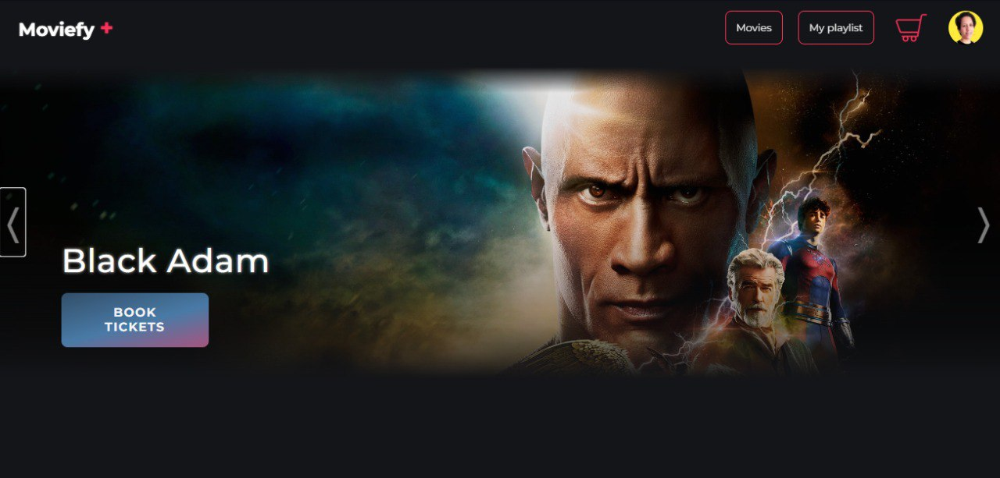
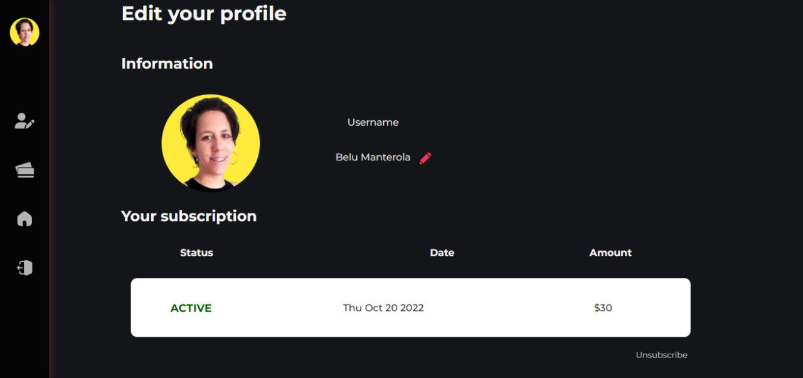
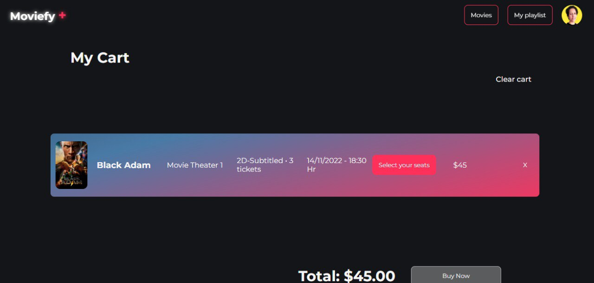
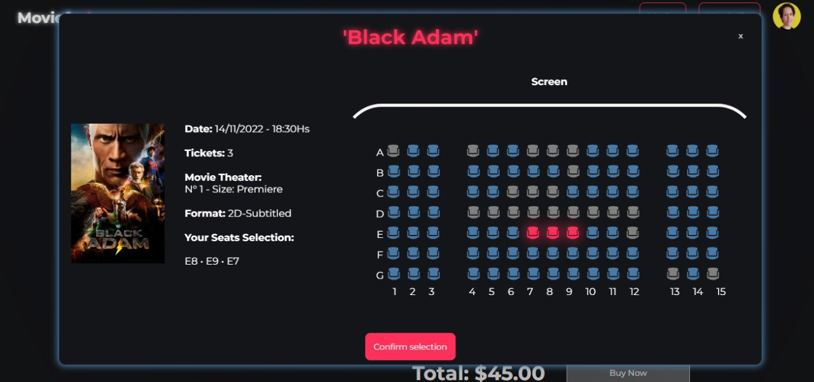
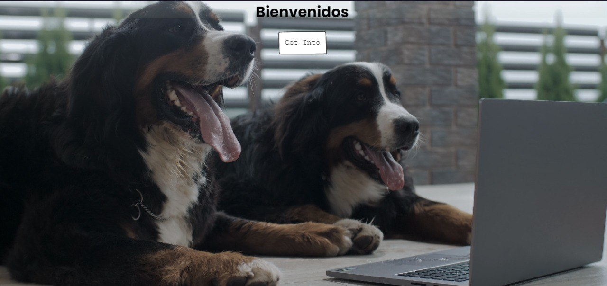
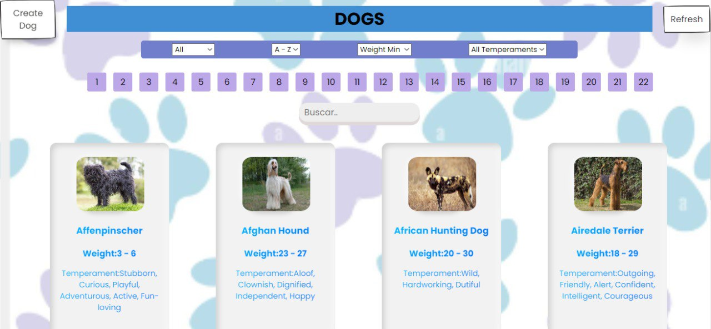
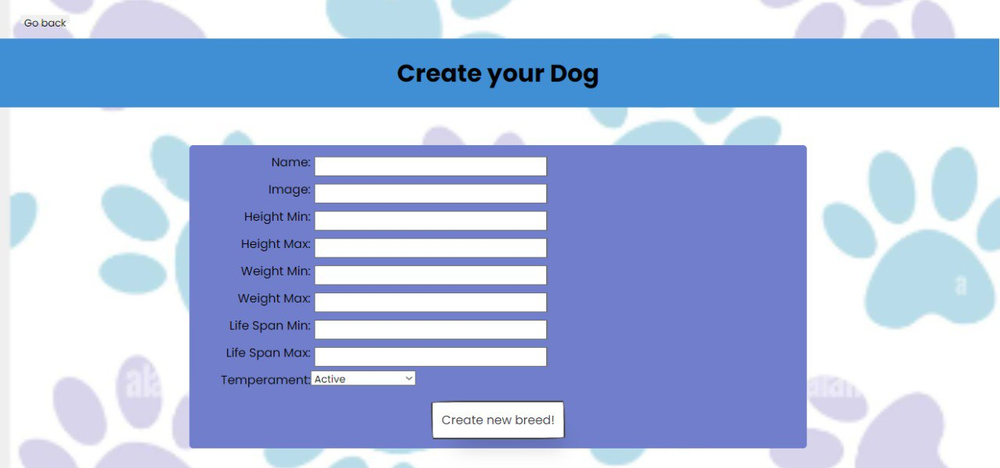

[+%7B%7D;render+%3CGitProfile%2F%3E;npm+start)](https://git.io/typing-svg)

<h1 align="center">Hola 👋, soy María Belén Manterola (Belu)</h1>
<h3 align="center">Una apasionada desarrollador web de Argentina</h3>

- 💬 ¿Quién soy yo? **Soy apasionada por el desarrollo web y la logica de programación con el deseo constante de aprender y trabajar en equipo.**

- 🤔 Algunos de mis hobbies: **Cocinar, leer, ver series y peliculas, dibujar**

- 📝 ¿Quieres contactarme? **Puedes hacerlo a través de Linkedin https://www.linkedin.com/in/belmant/ o vía email manterolabelu@outlook.es**

- 📫 Estudios actuales **En este momento estoy ingresando al mundo de React-Native**

---

<h3 align="left">Contacta conmigo:</h3>

 <h2>Correo: manterolabelu@outlook.es</h2> 
 <h2>LinkedIn:  <a href='https://www.linkedin.com/in/belmant/' target='_blank'>in/belmant/</a> </h2>

<h3 align="left">Languages and Tools:</h3>
    
 

 
  

  

# 👨‍💻 Mis proyectos:

## Moviefy + 
              

Diseñar y desarrollar una E-commerce de cine para venta de entradas y con servicio de streaming que incluía: pasarela de pagos, perfil de usuario y admin., auth de
terceros, envio de emails, filtros combinados,etc

### Algunas imagenes 
   

<a href='https://github.com/Clavi-K/PF-Henry-Back'> 📂 Ver repositorio Back</a><a href='https://github.com/mrtfog/PF-Henry-Front'> 📂 Ver repositorio Front</a>  <a href='https://hpfc.netlify.app'> 🌐 Ver proyecto </a>

## Dogs 

        

Proyecto individual (PI) requerido para la aprobacion del Bootcamp de Henry. Aqui se pone en prueba los conocimientos adquiridos durante el cursado del bootcamp en lo que respecta creacion de una base de datos relacional, la creacion de un Backend que conecte esta base de datos y la correspondiente coneccion con el Frontend para llegar a una SPA completamente funcional.

### Algunas imagenes 
   

<a href=https://github.com/belmant/PI-DOGS> 📂 Ver repositorio</a> 

---
<!--
**belmant/belmant** is a ✨ _special_ ✨ repository because its `README.md` (this file) appears on your GitHub profile.

Here are some ideas to get you started:

- 🔭 I’m currently working on ...
- 🌱 I’m currently learning ...
- 👯 I’m looking to collaborate on ...
- 🤔 I’m looking for help with ...
- 💬 Ask me about ...
- 📫 How to reach me: ...
- 😄 Pronouns: ...
- ⚡ Fun fact: ...
-->
